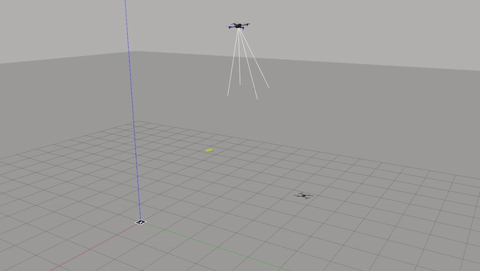
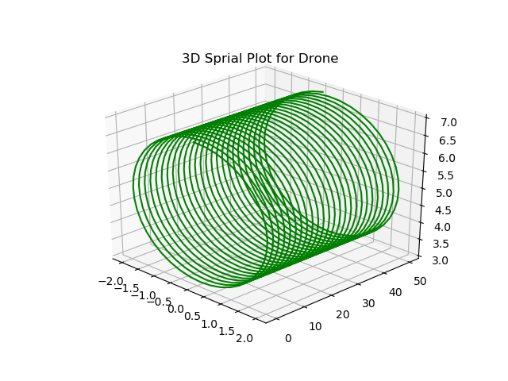

# Completing Zebu Intelligent Systems Assignment for Full Time Position 

Follow the Instructions for Setting Up and running the code. Make sure you have the right version of Ubuntu i.e Ubuntu 20.04 with ROS Melodic.
Remember only Mavros has been used in the python code using only rostopics and services of PX4 . No High level Serparate Library ahs been used such as dronekit, mavsdk python etc. 

<!-- 
<div  align="center">
 -->

<!-- </div>
<p align="center">
<em>Moving in Spiral</em>
</p> -->

<!-- 
<div  align="center">

</div> -->


## Setting Up the Simulator - PX4 with Gazebbo Classic 
- Follow https://docs.px4.io/main/en/dev_setup/dev_env_linux_ubuntu.html#ros-gazebo-classic for Setting up simulation in ROS Melodic

## After setting up PX4 with Gazebo classic 

* Open a new terminal and type:
```
sudo gedit ~/.bashrc
```
* Add the following lines to the file that opens:

```
source ~/catkin_ws/devel/setup.bash
source ~/catkin_ws/src/PX4-Autopilot/Tools/setup_gazebo.bash ~/catkin_ws/src/PX4-Autopilot/ ~/catkin_ws/src/PX4-Autopilot/build/posix_sitl_default
export ROS_PACKAGE_PATH=ROS_PACKAGE_PATH:~/catkin_ws/src/PX4-Autopilot
export ROS_PACKAGE_PATH=ROS_PACKAGE_PATH:~/catkin_ws/src/PX4-AutopilotTools/sitl_gazebo
```
## Install  Apriltag ROS for Pose Estimation and tag detection
- Use https://github.com/AprilRobotics/apriltag_ros for cloning and instuction of using apriltag

## Changing Camera to downward facing Camera & setting up apriltag config
- Replace the iris_fav_cam model in PX4-Autopilot/Tools/simulation/gazebo_classic/models with model in /models.
- Replace the config in apriltag_ros with configs in /configs
- Please redirect approprite camera feed topic as per your convinience in Apriltag_ros launch files.(Topic : /iris/usb_cam, Launch File: continuous_detection.launch)

## Finally build the workspace
- launch mymav.launch 
```
roslaunch zebu_assignment mymav.launch
```

- Run Question1_2.py : By default Question 2 shows functionalities of 1 and 2 So the Spral function is already on. Please Uncomment Sprial_trej() in case not requied. We can increse the pitch length of spiral after which it comes back home, folloing spiral trejectory till infity in single loop would be weird so I have added this fuctionality.
```
python3 Question1_2.py
```
- For running Q3 first Run Detection stack for Tag:
```
ROS_NAMESPACE=/iris/usb_cam rosrun image_proc image_proc
```
In another Terminal:
```
roslaunch apriltag_ros continuous_detection.launch
```

- Run Quesion3.py : The drone goes to a point where it can see the tag and then tries to land on the tag. A separate class implements a PD controller that uses the detected pose to land.(The pose has high noice due to camera calibration not performed So current performace is subpar)
```
python3 Question3.py
```

# Something beyond assignment
- For a Better Implementation of Quesiton3.py with a reitreative Pure Pursuit planner and highly precise landing. Please REFER to My old Paper and Repository which completes the Question 3 in a diffrent way, this code was develped by me while interning at CSIR CEERI Pilani. 
-- Publication: https://ieeexplore.ieee.org/document/9828198/
-- Github: https://github.com/offjangir/Drone_Landing_PP
